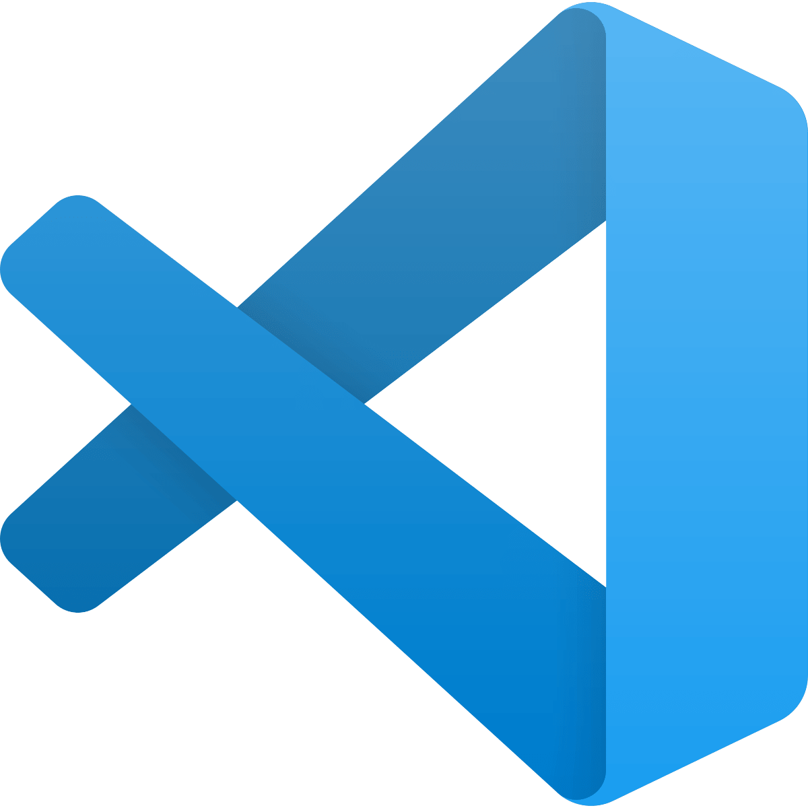
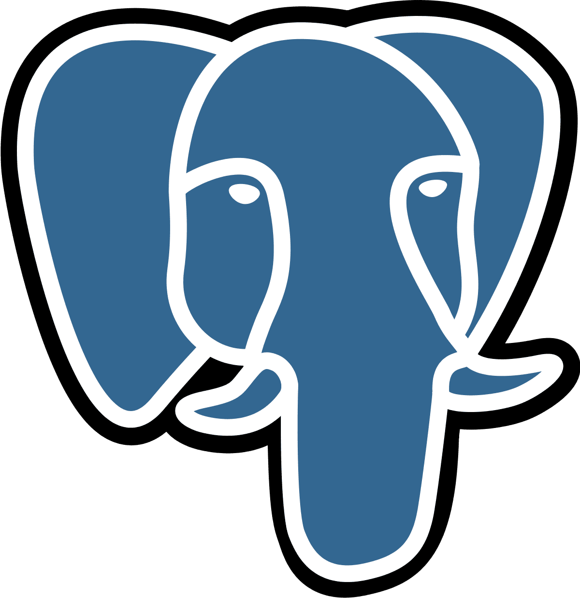
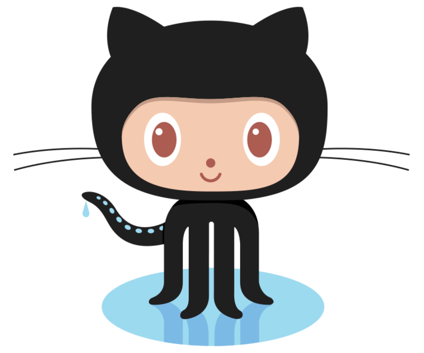
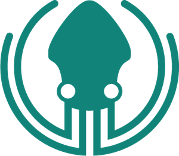
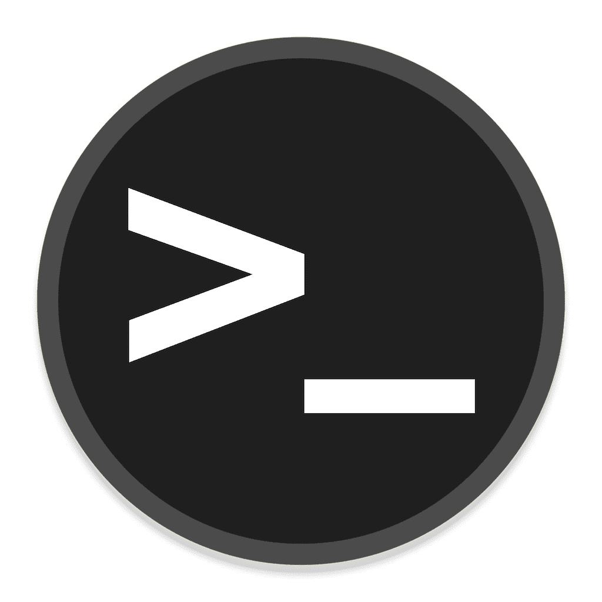
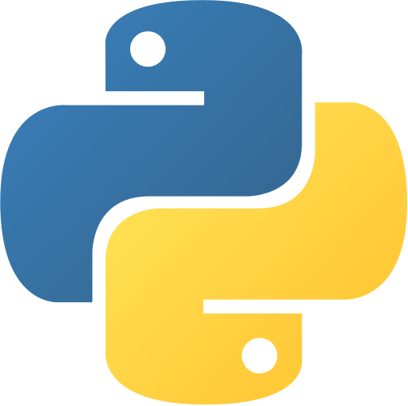
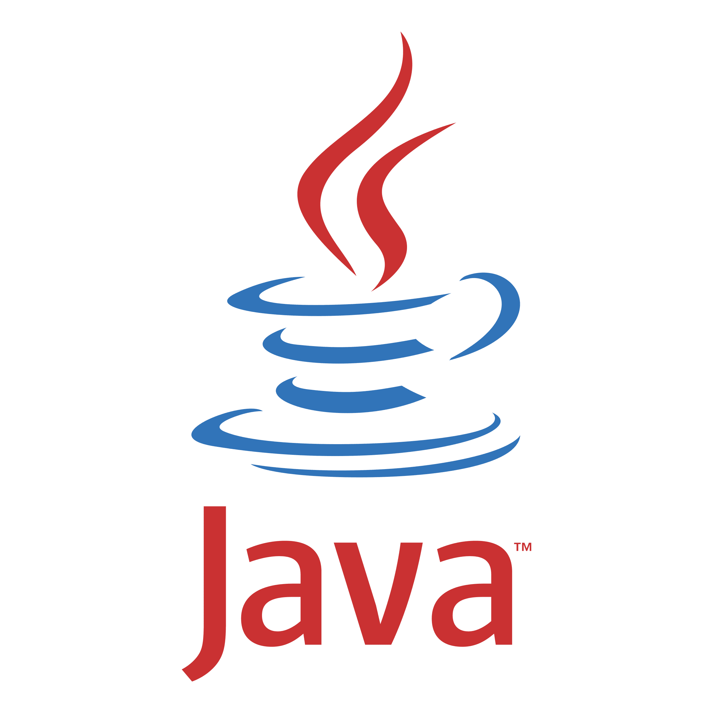
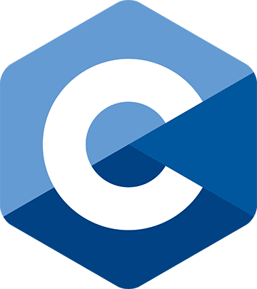
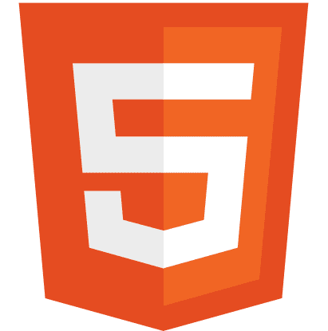
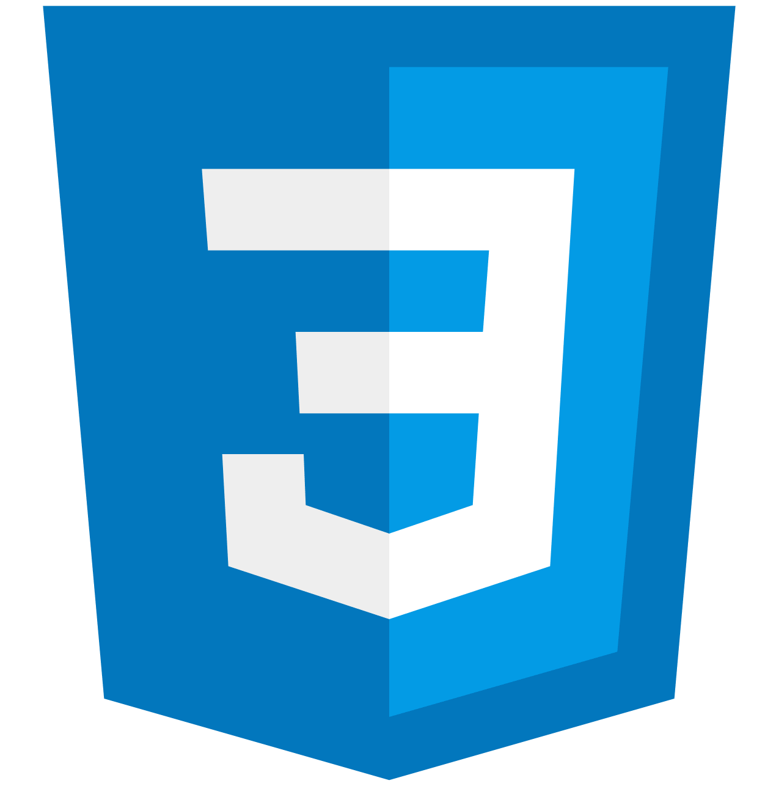

# Hi everyone, I'm Alexis 👋

- 🌱 I am currently a French student in the field of computer science (programming, project management, data science, ...)
- 👯 I’m looking to collaborate with other content creators
- 🥅 2021 Goals : Get my engineering degree and contribute more to Open Source projects
- ⚡ Fun fact: I love to play video games and ride my motorbike

## My tools and languages

 
 
 

 
